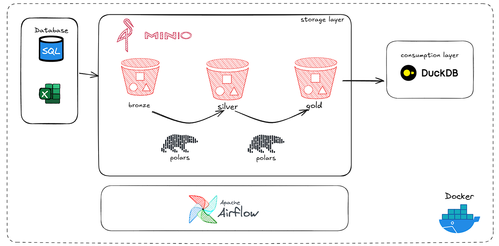

# onpremise-datalake

## Visão Geral

Este projeto demonstra a criação de uma arquitetura de data lake utilizando tecnologias on-premise. O objetivo é fornecer um exemplo prático e simplificado de como implementar um data lake sem depender de serviços em nuvem.



## Tecnologias Utilizadas

- **Apache Airflow**: Orquestração de workflows
- **MinIO**: Armazenamento de objetos compatível com S3
- **DuckDB**: Banco de dados analítico
- **Polars**: Processamento de dados em memória

Obs: Embora o Polars seja usado para processamento de dados neste projeto, ele poderia ser substituído por outras tecnologias como Apache Spark, dependendo dos requisitos de carga de trabalho. A escolha do Polars visa manter a simplicidade da implementação.

## Pré-requisitos

Antes de começar, certifique-se de ter instalado:

1. [Docker](https://docs.docker.com/desktop/)
2. [Astro CLI](https://www.astronomer.io/docs/astro/cli/install-cli)

## Instalação e Configuração

1. Clone o repositório:
   ```
   git clone https://github.com/alandrebraga/onpremise-datalake
   ```

2. Navegue até o diretório do projeto e inicialize o projeto Airflow:
   ```
   cd onpremise-datalake
   astro dev init
   ```
   Nota: Quando solicitado para inicializar o projeto em um diretório não vazio, responda "Yes".

3. Inicie os containers:
   ```
   astro dev start
   ```
   Isso iniciará todos os containers necessários, incluindo MinIO e DuckDB.

## Configurando o DuckDB para Consultas

Para executar consultas nos arquivos Parquet armazenados no MinIO, siga estes passos:

1. Conecte-se ao DuckDB:
   ```
   duckdb nba.db
   ```

2. Configure a conexão S3 (MinIO):
   ```sql
   CREATE OR REPLACE SECRET secret1 (
       TYPE S3,
       KEY_ID 'minio',
       SECRET 'miniopassword',
       REGION 'us-east1',
       ENDPOINT 'minio:9000',
       USE_SSL false,
       URL_STYLE 'path'
   );
   ```

3. Crie tabelas a partir dos arquivos Parquet:
   ```sql
   CREATE TABLE dim_team AS SELECT * FROM 's3://nba/gold/dim_team.parquet';
   CREATE TABLE dim_player AS SELECT * FROM 's3://nba/gold/dim_player.parquet';
   CREATE TABLE fact_nba AS SELECT * FROM 's3://nba/gold/fact_nba.parquet';
   ```

4. Execute consultas:
   ```sql
   SELECT * FROM dim_team;
   -- ou diretamente do arquivo Parquet:
   SELECT * FROM 's3://nba/gold/dim_player.parquet';
   ```
